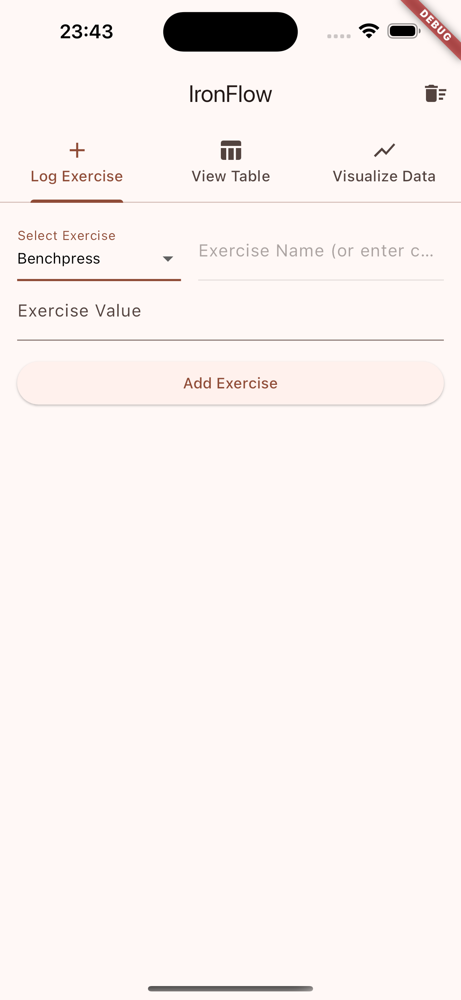
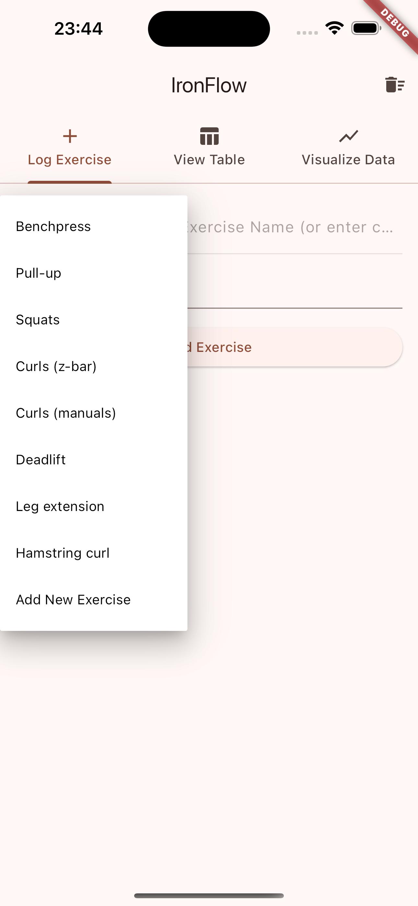
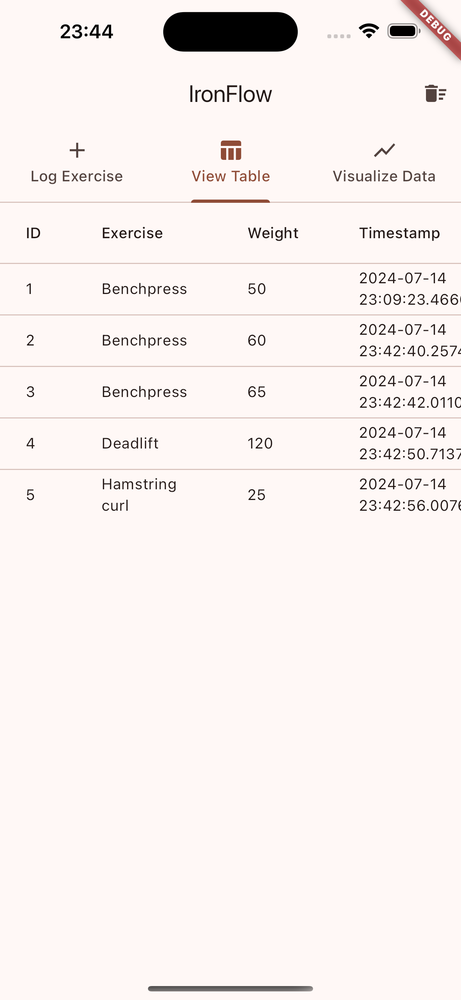
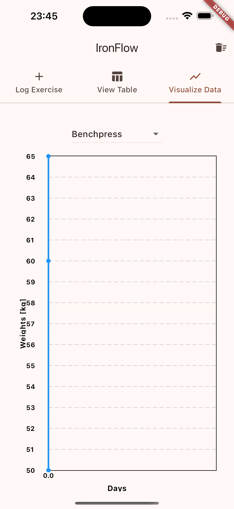

<h1 align="center">IronFlow</h1>
<h3 align="center">Strength training and fitness app for mobile devices.</h3>

**IronFlow** was developed to allow free, seemless, and private tracking of training progress and activities.

   

## Continuous integration

| Build Type | Status |
| - | - |
| **Build APK** |  |
| **Build IPA** |  |

## Getting started

A cross-platform mobile app was developed to test the produced solutions. Installers for both
Android (.apk) and iOS (.ipa) were developed. To install the app, a different approach is required
on Android and iOS.

### Android

1. On the mobile device (e.g., Samsung), go to Settings > About phone > Software information > Click the `Build number` 5 times. Then say `yes` to enable developer mode.
2. On the mobile device, download the APK from [releases](https://github.com/andreped/IronFlow/releases).
3. Go to Files > Downloads and click the downloaded file. After uncompression click the `*.apk` file.
4. You should get prompted _"Unsafe app blocked"_. Click on `More details` and press `Install anyways`.

Then simply use the app as you would with any other Android app.

### iOS

1. Connect the mobile device (e.g., iPhone) to a desktop device (e.g., macbook) with USB cable.
2. On the desktop device, download the IPA from [releases](https://github.com/andreped/IronFlow/releases).
3. On the desktop device, go to `Finder`, and then unlock the mobile device. The phone should then be accessbile from the left-hand side in Finder, and click on it.
4. On the desktop device, open a new `Finder` window, go to `Downloads` and uncompress the downloaded file. Drag-and-drop the `.ipa` file over the iPhone Finder window.
5. After a few seconds, the mobile app should then be installed (you can see the progress on both the mobile device and in the Finder mobile app window).
6. On the mobile device, to allow the app to be used, go to `General` > `VPN & Device Management` and click on the app and `Allow`.

Then simply use the app as you would with any other iOS app.

## License

This project has MIT License.
