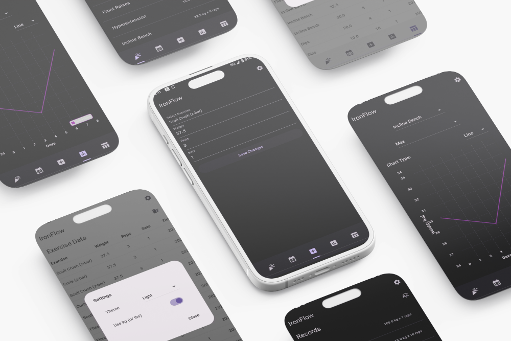

 

<h1 align="center">IronFlow</h1>
<h3 align="center">Cross-platform mobile app for strength training progress tracking.</h3>

<h3 align="center"> 

</h3>

**IronFlow** was developed to allow free, private, and seemless tracking of training progress and activities.

## [Features](https://github.com/andreped/IronFlow#Features)

The app is compatible with both Android and iOS.

- [x] Ability to save individual exercises with weight and number of reps and sets.
- [x] All data is stored in a private SQLite database on the device.
- [x] Ability to add new exercises.
- [x] Database with all new exercises and sessions are preserved when upgrading app.
- [x] Tab to see current max weight lifted for each recorded exercise.
- [x] Summary tab showing exercise details for any given day.
- [x] Ability to change days in summary tab to see history.
- [x] Visualize individual weight lifted for each exercise over time.
- [x] Ability to inspect and edit all exercise runs from a table tab.
- [x] Notification when new weight record is saved.
- [x] Defined large set of predefined exercises to avoid needing to add new exercises manually.
- [x] Set or add new exercise in log tab now only shows 5 items in dropdown and is scrollable.
- [x] Faster exercise logging using previously stored data for given exercise as prefilled values.
- [x] Database clear button now has two-step dialog to safeguard data from accidental deletion.
- [x] Max weight notification takes into account max weight lifted AND number of reps.

## [Continuous Integration](https://github.com/andreped/IronFlow#Continuous-Integration)

| Build Type | Status |
| - | - |
| **Build APK** |  |
| **Build IPA** |  |
| **Create Release** |  |
| **Integration tests** |  |
| **Linting** |  |

## [Integration Tests](https://github.com/andreped/IronFlow#Integration-Tests)

For testing the application, we use [Maestro](https://github.com/mobile-dev-inc/maestro).  
Integration tests are performed for all pull requests and before releases using [GitHub Actions](https://github.com/andreped/IronFlow/actions/workflows/integration_tests.yml).

## [Getting Started](https://github.com/andreped/IronFlow#Getting-Started)

A cross-platform mobile app was developed to test the produced solutions. Installers for both
Android (.apk) and iOS (.ipa) were developed. To install the app, a different approach is required
on Android and iOS.

## [Android](https://github.com/andreped/IronFlow#Android)

1. On the mobile device (e.g., Samsung), go to Settings > About phone > Software information > Click the `Build number` 5 times. Then say `yes` to enable developer mode.
2. On the mobile device, download the APK from [releases](https://github.com/andreped/IronFlow/releases).
3. Go to Files > Downloads and click the downloaded file. After uncompression click the `*.apk` file.
4. You should get prompted _"Unsafe app blocked"_. Click on `More details` and press `Install anyways`.

Then simply use the app as you would with any other Android app.

## [iOS](https://github.com/andreped/IronFlow#iOS)

1. Connect the mobile device (e.g., iPhone) to a desktop device (e.g., macbook) with USB cable.
2. On the desktop device, download the IPA from [releases](https://github.com/andreped/IronFlow/releases).
3. On the desktop device, go to `Finder`, and then unlock the mobile device. The phone should then be accessbile from the left-hand side in Finder, and click on it.
4. On the desktop device, open a new `Finder` window, go to `Downloads` and uncompress the downloaded file. Drag-and-drop the `.ipa` file over the iPhone Finder window.
5. After a few seconds, the mobile app should then be installed (you can see the progress on both the mobile device and in the Finder mobile app window).
6. On the mobile device, to allow the app to be used, go to `General` > `VPN & Device Management` and click on the app and `Allow`.

Then simply use the app as you would with any other iOS app.

## [License](https://github.com/andreped/IronFlow#license)

This project has [MIT License](https://github.com/andreped/IronFlow/blob/main/LICENSE).

## [Acknowledgements](https://github.com/andreped/IronFlow#Acknowledgements)

I want to acknowledge [Scarlet](https://usescarlet.com) for providing me a free service to
sign my IPA which allows me to support iOS.

Using [Maestro](https://maestro.mobile.dev) has allowed us to implement integration tests with ease!
Especially, Maestro studio which provided a user-friendly, no-code interface to create test flows.

To reduce development time and get experience with Copilots, 
this Flutter application was heavily assisted by [OpenAI's ChatGPT](https://chatgpt.com),
primarily using `GPT-4o-mini`.
